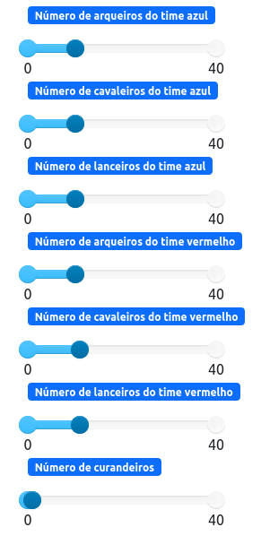

# Campo de Batalha

**Disciplina**: FGA0210 - PARADIGMAS DE PROGRAMAÇÃO - T01 <br>
**Nro do Grupo** : 05<br>
**Paradigma**: SMA<br>

## Alunos

| Matrícula | Aluno                                                                    |
| --------- | ------------------------------------------------------------------------ |
| 150125682 | [Flávio Vieira Leão](https://github.com/flaviovl)                        |
| 170011020 | [Gabrielle Ribeiro Gomes](https://github.com/Gabrielle-Ribeiro)          |
| 170107426 | [Kayro César Silva Machado](https://github.com/kayrocesar)               |
| 170016838 | [Lucas Lopes Xavier](https://github.com/lucaslop)                        |
| 180105604 | [Luis Gustavo Ferreira Marques](https://github.com/luisgfmarques)        |
| 180106805 | [Mateus Cunha Maia](https://github.com/mateusmaiamaia)                   |
| 170122549 | [Paulo Goncalves Lima](https://github.com/PauloGoncalvesLima)            |
| 190117401 | [Thalisson Alves Gonçalves de Jesus](https://github.com/Thalisson-Alves) |
| 180149598 | [Victor Hugo Siqueira Costa](https://github.com/8ifq3)                   |

## Sobre
Desenvolvemos um projeto de simulador de campo de batalha em um ambiente caótico, com o objetivo de permitir o controle da quantidade de combatentes de cada lado, como arqueiros, cavaleiros e lanceiros, além de possibilitar o controle dos agentes neutros, os curandeiros. Além disso, implementamos uma lógica de alcance e dano para os ataques de cada agente contra seus inimigos.

No simulador, estabelecemos que os lanceiros só conseguem atacar inimigos a duas casas de distância, os cavaleiros atacam a uma casa de distância e os arqueiros atacam a três casas de distância. Por sua vez, os curandeiros têm a habilidade de aumentar a vida dos combatentes próximos a eles, desde que estejam a uma casa de distância.

Utilizamos o framework MESA para construir o simulador, aproveitando os conceitos dos sistemas multiagentes para modelar o comportamento dos diferentes agentes e seus tipos. Com isso, conseguimos definir as interações entre os agentes, como os ataques e a cura, bem como as regras de movimentação e estratégias de combate. Dessa forma, é possível observar o comportamento que surge das interações complexas entre os agentes no campo de batalha.

## Screenshots

<div style="display: flex; flex-wrap: wrap;">
  <div style="flex-basis: 50%; padding: 5px;">
    
  </div>
  <div style="flex-basis: 50%; padding: 5px;">
    
  </div>
  <div style="flex-basis: 50%; padding: 5px;">
    
  </div>
  <div style="flex-basis: 50%; padding: 5px;">
    
  </div>
</div>

## Instalação
**Linguagens**: Python<br>
**Tecnologias**: Mesa (Framework)<br>

### Pré-requisitos:
- Python 3 ou superior
- Mesa

### Passo 1: Caso não possua o python instalado, execute os comandos abaixo
```
 sudo apt-get update
```
```
 sudo apt-get install python3.6
 ```
### Passo 2: Clone o repositório
```
git clone https://github.com/UnBParadigmas2023-1/2023.1_G5_SMA_Campo_De_Batalha.git
```
### Passo 3: Entre na pasta do projeto
```
cd 2023.1_G5_SMA_Campo_De_Batalha
```
### Passo 4: Instale as dependências
```
pip install -r requirements.txt
```
### Passo 5: Rode o programa
```
 python3 run.py
```
### Passo 6: Abra o servidor no navegador usando o endereço especificado


## Uso
Com o código sendo executado, na interface do MESA, o usuário pode realizar as seguintes ações:

- Manipular os _sliders_ para modificar os parâmetros do ambiente, localizados no canto superior esquerdo da tela.
    - **Número de arqueiros aliados e inimigos:** Controla o número de agentes arqueiros aliados e inimigos que aparecerão no grid.
    - **Número de cavaleiros aliados e inimigos:** Controla o número de agentes cavaleiros aliados e inimigos  que aparecerão no grid.
    - **Número de lanceiros aliados e inimigos:** Controla o número de lanceiros aliados e inimigos que aparecerão no grid.
    - **Número de curandeiros:**
    Controla o número de curandeiros que aparecerão no grid



- Manipular o _slider_ para modificar a velocidade da simulação, localizado no parte superior do _grid_.


- Pressionar o botões de controle da simulação, localizados no canto superior direito da tela
    - **Start:** Inicia a simulação
    - **Stop:** Para a simulação
    - **Reset:** Reseta a simulação
    - **Step:** Executa um passo da simulação

## Vídeo

<a href="https://www.youtube.com/watch?v=-bBdX1QDTKI">Link da apresentação</a>

## Participações

| Nome do Membro                                                           | Contribuição | Significância da Contribuição para o Projeto (Excelente/Boa/Regular/Ruim/Nula) |
| ------------------------------------------------------------------------ | ------------ | ------------------------------------------------------------------------------ |
| [Flávio Vieira Leão](https://github.com/flaviovl)                        |  Criei a estrutura inicial dos agentes cavaleiro, lanceiro e arqueiro e participei no processo de refatoração e melhorias |    Boa                                                                         |
| [Gabrielle Ribeiro Gomes](https://github.com/Gabrielle-Ribeiro)          |  Ajudei na adição de assets no projeto e na correção de algumas lógicas.   |                  Regular                                                           |
| [Kayro César Silva Machado](https://github.com/kayrocesar)               |  Ajudei no levantamento de ideias , na criação da estrutura geral do projeto e dos agentes de diferentes tipos como arqueiro, lanceiro e cavaleiro, também auxiliei nas funções de movimentação, estruturação do server e gerencia do grupo         |      Excelente                                                                      |
| [Lucas Lopes Xavier](https://github.com/lucaslop)                        | De modo geral, minha maior contribuição foi no auxilio da criação do agente lanceiro, onde pude contribuir com mais complexidade ao projeto. Além disso, contribuir para ajudar a entender a lógica dos ids dos agentes e do range de ataque.          |        Boa                                                                     |
| [Luis Gustavo Ferreira Marques](https://github.com/luisgfmarques)        | Realizei a implementação do sistema de dano com porcentágem, atém de implementar algumas refatorações no código.       | Regular                                                                              |
| [Mateus Cunha Maia](https://github.com/mateusmaiamaia)                   |     Fiz a modificação nos arquivos server.py e modelo.py para poder escolher exatamente a quantidade de agentes seriam colocados dentro do campo de batalha, além de ajudar na criação do projeto no geral, com a correção da lógica de ataque, criação do readme e na resolução de alguns bugs no geral       |           Boa                              |
| [Paulo Goncalves Lima](https://github.com/PauloGoncalvesLima)            | Padronização do projeto com a mudança de portugues para inglês e o nome das classes.          |            Ruim                                                                 |
| [Thalisson Alves Gonçalves de Jesus](https://github.com/Thalisson-Alves) | Contribui com a adição do agente Healer, melhorias na lógica de movimentação e spawns dos agentes, correções/integrações de outras funcionalidades | Excelente |
| [Victor Hugo Siqueira Costa](https://github.com/8ifq3)                   | Trabalhei na parte da concepção da ideia do projeto, dando sugestão e ajustando a implementação durante todo o decorrer do desenvolvimento; no funcionamento durante a utilização da interface do servidor do MESA; no funcionamento da criação e movimentação dos agentes durante a execução; na lógica do combate entre os agente; correção de bugs e refinamento das idéias. | Boa |

## Outros
### I. Lições Aprendidas

Durante o desenvolvimento do simulador de campo de batalha, obtivemos importantes lições sobre a aplicação do paradigma de sistemas multiagentes. Foi desafiador adaptar as ferramentas disponíveis para criar uma simulação realista de combate estratégico. A ausência de um "Jogador" da maneira convencional que conhecemos nos levou a focar na modelagem do comportamento dos diferentes agentes de batalha e a explorar a interação entre eles, incluindo lógicas de movimentação, alcance e dano. Embora tenhamos enfrentado dificuldades na implementação, a experiência nos proporcionou um maior entendimento dos desafios e possibilidades acerca do paradigma, que pode ser extremamente útil e complexo em aplicações do mundo real.

### II. Percepções

Ao trabalhar no simulador de campo de batalha, foi possível perceber a influência dos paradigmas de orientação a objetos e adaptá-los para uma abordagem mais adequada aos sistemas multiagentes. Dessa forma, compreendemos a necessidade de pensar em termos de comportamento e interações  entre os agentes de combate. Essa mudança de perspectiva nos permitiu compreender melhor as dinâmicas de batalha, o impacto das estratégias e as ações adotadas por cada tipo de agente.

### III. Contribuições e Fragilidades

Identificamos contribuições significativas em nosso projeto de simulador de campo de batalha, mas também reconhecemos algumas fragilidades. Um aspecto positivo é a modelagem dos agentes de combate, que conseguimos representar de forma realista em relação ao alcance e dano de seus ataques. No entanto, existem aspectos que limitam um pouco a flexibilidade e adaptabilidade dos agentes em situações complexas de batalha.

### IV. Trabalhos Futuros

Com base nas experiências adquiridas, identificamos vários aspectos interessantes para trabalhos futuros como: aprimorar o comportamento dos agentes, criar mais agentes e elementos mais dinâmicos no campo de batalha, explorar mais as táticas de combate, incluir táticas de defesa e aprendizado para cada agente baseado nos combates realizados.

## Fontes

> MESAPROJECT. Mesa: Agent-Based Modeling in Python 0.8.9 documentation. Disponível em: https://mesa.readthedocs.io/en/stable/. Acesso em: 2 jul. 2023.

> GITHUB. Project MESA: Examples Repository. Disponível em: https://github.com/projectmesa/mesa-examples/tree/main/examples. Acesso em: 29 jul. 2023.

> NORTHWESTERN UNIVERSITY. Center for Connected Learning and Computer-Based Modeling (CCL): NetLogo Models. Disponível em: https://ccl.northwestern.edu/netlogo/models/. Acesso em: 3 jul. 2023.

> SERRANO, Milene. SMA - Paradigmas de Programação. Disponível em: https://aprender3.unb.br/pluginfile.php/2482516/mod_label/intro/slidesAula01bSMA.pdf. Acesso em: 3 jul. 2023.
