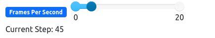

# RepositorioTemplate
Esse repositório é para ser utilizado pelos grupos como um template inicial, da home page do Projeto.
As seções do Template NÃO DEVEM SER OMITIDAS, sendo TODAS RELEVANTES.

**!! *Atenção: Renomeie o seu repositório para (Ano.Semestre)_(Grupo)_(Paradigma)_(NomeDoProjeto)*. !!** 

Paradigmas:
 - Funcional
 - Logico
 - SMA

**!! *Não coloque os nomes dos alunos no título do repositório*. !!**

**!! *Exemplo de título correto: 2022.2_G1_Logico_ProjetoRoteirosAereos*. !!**
 
 (Apague esses comentários)

# NomeDoProjeto

**Disciplina**: FGA0210 - PARADIGMAS DE PROGRAMAÇÃO - T01  
**Nro do Grupo (de acordo com a Planilha de Divisão dos Grupos)**: 05 
**Paradigma**: SMA 

## Alunos

| Matrícula | Aluno                                                                    |
| --------- | ------------------------------------------------------------------------ |
| 150125682 | [Flávio Vieira Leão](https://github.com/flaviovl)                        |
| 170011020 | [Gabrielle Ribeiro Gomes](https://github.com/Gabrielle-Ribeiro)          |
| 170107426 | [Kayro César Silva Machado](https://github.com/kayrocesar)               |
| 170016838 | [Lucas Lopes Xavier](https://github.com/lucaslop)                        |
| 180105604 | [Luis Gustavo Ferreira Marques](https://github.com/luisgfmarques)        |
| 180106805 | [Mateus Cunha Maia](https://github.com/mateusmaiamaia)                   |
| 170122549 | [Paulo Goncalves Lima](https://github.com/PauloGoncalvesLima)            |
| 190117401 | [Thalisson Alves Gonçalves de Jesus](https://github.com/Thalisson-Alves) |
| 180149598 | [Victor Hugo Siqueira Costa](https://github.com/8ifq3)                   |

## Sobre 
O projeta que desenvolvemos se trata de um simulador de campo de batalha em um ambiente caótico. A ideia desse projeto é poder contolar a quantidade de combatentes de cada lado como arqueiros, cavaleiros e lanceiros, assim como controlar a quantidade de agentes neutros, os curandeiros no caso. Utilizando o Framework MESA e com o tema desse projeto, é possível utilizar os conceitos dos paradigmas de sistemas multi-agentes para construir esse projeto, demostrando o comportamento dos diferentes agentes.  

## Screenshots
Adicione 2 ou mais screenshots do projeto em termos de interface e/ou funcionamento.

## Instalação 
**Linguagens**: xxxxxx 
**Tecnologias**: xxxxxx 
Descreva os pré-requisitos para rodar o seu projeto e os comandos necessários.
Insira um manual ou um script para auxiliar ainda mais.
Gifs animados e outras ilustrações são bem-vindos!

## Uso 
Com o código sendo executado, na interface do MESA, o usuário pode realizar as seguintes ações:

- Manipular os _sliders_ para modificar os parâmetros do ambiente, localizados no canto superior esquerdo da tela.
    - **Número de arqueiros aliados e inimigos:** Controla o número de agentes arqueiros aliados e inimigos que aparecerão no grid.
    - **Número de cavaleiros aliados e inimigos:** Controla o número de agentes cavaleiros aliados e inimigos  que aparecerão no grid.
    - **Número de lanceiros aliados e inimigos:** Controla o número de lanceiros aliados e inimigos que aparecerão no grid.
    - **Número de curandeiros:**
    Controla o número de curandeiros que aparecerão no grid

- Manipular o _slider_ para modificar a velocidade da simulação, localizado no parte superior do _grid_.

- Pressionar o botões de controle da simulação, localizados no canto superior direito da tela
    - **Start:** Inicia a simulação
    - **Stop:** Para a simulação
    - **Reset:** Reseta a simulação
    - **Step:** Executa um passo da simulação

## Vídeo
Adicione 1 ou mais vídeos com a execução do projeto.
Procure: 
(i) Introduzir o projeto;
(ii) Mostrar passo a passo o código, explicando-o, e deixando claro o que é de terceiros, e o que é contribuição real da equipe;
(iii) Apresentar particularidades do Paradigma, da Linguagem, e das Tecnologias, e
(iV) Apresentar lições aprendidas, contribuições, pendências, e ideias para trabalhos futuros.
OBS: TODOS DEVEM PARTICIPAR, CONFERINDO PONTOS DE VISTA.
TEMPO: +/- 15min

## Participações
Apresente, brevemente, como cada membro do grupo contribuiu para o projeto.
|Nome do Membro | Contribuição | Significância da Contribuição para o Projeto (Excelente/Boa/Regular/Ruim/Nula) |
| -- | -- | -- |
| Fulano  |  Programação dos Fatos da Base de Conhecimento Lógica | Boa |

## Outros 
Quaisquer outras informações sobre o projeto podem ser descritas aqui. Não esqueça, entretanto, de informar sobre:
(i) Lições Aprendidas;
(ii) Percepções;
(iii) Contribuições e Fragilidades, e
(iV) Trabalhos Futuros.

## Fontes
Referencie, adequadamente, as referências utilizadas.
Indique ainda sobre fontes de leitura complementares.
